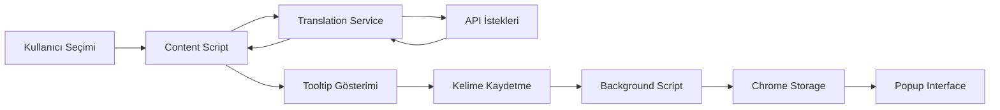

# Word Learning Assistant - Sistem Dokümantasyonu

## 1. Proje Amacı

Word Learning Assistant, web sayfalarında okuma yaparken yabancı dildeki kelimelerin anlamını hızlıca öğrenmek ve kaydetmek için geliştirilmiş bir Chrome uzantısıdır. Temel amaçları:

- Seçilen kelimelerin anında çevirisini göstermek
- Örnek cümlelerle kullanım bağlamını sağlamak
- Öğrenilen kelimeleri kaydetmek ve daha sonra tekrar etmek
- Kullanıcı dostu ve sezgisel bir arayüz sunmak

## 2. Sistem Mimarisi

### 2.1 Temel Bileşenler

1. **Content Script (`content.js`)**

   - Sayfa içi metin seçimi yönetimi
   - Tooltip oluşturma ve konumlandırma
   - Çeviri isteklerini yönetme
   - Kullanıcı etkileşimlerini işleme

2. **Translation Service (`translationService.js`)**

   - MyMemory Translation API entegrasyonu
   - Tatoeba API ile örnek cümle getirme
   - Çeviri sonuçlarını normalize etme
   - Hata yönetimi

3. **Background Script (`background.js`)**

   - Kelime kaydetme işlemleri
   - Chrome storage yönetimi
   - Badge güncellemeleri

4. **Popup Interface (`popup.html`, `popup.js`)**
   - Kaydedilen kelimeleri listeleme
   - Kelime detaylarını gösterme
   - Kullanıcı arayüzü

### 2.2 Veri Akışı



## 3. Teknik Detaylar

### 3.1 Performans Optimizasyonları

1. **Debouncing**

   - Hızlı ardışık istekleri önleme
   - API kullanım limitlerini koruma
   - 300ms bekleme süresi

2. **State Yönetimi**

   - `isTranslating` flag'i ile çoklu istekleri engelleme
   - Tooltip durumunu takip etme
   - Son çevrilen metni önbellekleme

3. **Event Yönetimi**
   - Gereksiz event tetiklemelerini filtreleme
   - Event delegation kullanımı
   - Tooltip içi tıklamaları optimize etme

### 3.2 Güvenlik Önlemleri

1. **API Güvenliği**

   - Rate limiting kontrolü
   - Hata mesajlarını gizleme
   - API anahtarlarını güvenli saklama

2. **Veri Doğrulama**
   - Kullanıcı girişi sanitizasyonu
   - JSON parse güvenliği
   - XSS önleme

### 3.3 Kullanıcı Deneyimi

1. **Görsel Geri Bildirim**

   - Yükleme durumu gösterimi
   - Başarı/hata mesajları
   - Otomatik tooltip kapatma

2. **Erişilebilirlik**
   - Klavye navigasyonu desteği
   - Yüksek kontrast oranları
   - Uygun font boyutları

## 4. API Entegrasyonları

### 4.1 MyMemory Translation API

- Endpoint: `https://api.mymemory.translated.net/get`
- Rate Limit: Günlük 1000 kelime
- Özellikler:
  - Metin çevirisi
  - Dil algılama
  - Kalite skoru

### 4.2 Tatoeba API

- Endpoint: `https://tatoeba.org/eng/api_v0/search`
- Özellikler:
  - Örnek cümle arama
  - Çoklu dil desteği
  - Bağlam tabanlı sonuçlar

## 5. Geliştirme Kılavuzu

### 5.1 Kod Standartları

1. **Dosya Organizasyonu**

   ```
   extension/
   ├── src/
   │   ├── background.js
   │   ├── content.js
   │   ├── translationService.js
   │   └── popup/
   ├── styles/
   └── assets/
   ```

2. **Naming Conventions**

   - camelCase fonksiyon ve değişken isimleri
   - İngilizce değişken isimleri
   - Açıklayıcı fonksiyon isimleri

3. **Kod Formatı**
   - 2 space indentation
   - Semicolon kullanımı
   - Single quote string kullanımı

### 5.2 Hata Yönetimi

1. **Try-Catch Blokları**

   - API isteklerinde
   - JSON parse işlemlerinde
   - Storage işlemlerinde

2. **Hata Mesajları**
   - Kullanıcı dostu mesajlar
   - Detaylı loglama
   - Hata kategorileri

### 5.3 Test Stratejisi

1. **Manuel Testler**

   - Çeviri fonksiyonalitesi
   - Kelime kaydetme
   - UI/UX testleri

2. **Edge Cases**
   - Uzun metinler
   - Özel karakterler
   - Bağlantı kopması

## 6. Gelecek Geliştirmeler

1. **Özellik İstekleri**

   - Offline mod desteği
   - Daha fazla dil desteği
   - Kelime tekrar sistemi

2. **Teknik İyileştirmeler**

   - Service Worker optimizasyonu
   - IndexedDB kullanımı
   - PWA desteği

3. **UI/UX İyileştirmeleri**
   - Dark mode desteği
   - Özelleştirilebilir temalar
   - Mobil uyumluluk

## 7. Bakım ve İzleme

1. **Performans Metrikleri**

   - API yanıt süreleri
   - Bellek kullanımı
   - Storage kullanımı

2. **Hata İzleme**

   - Console logları
   - API hata oranları
   - Kullanıcı geri bildirimleri

3. **Güncellemeler**
   - API değişiklikleri
   - Chrome API güncellemeleri
   - Güvenlik yamaları
